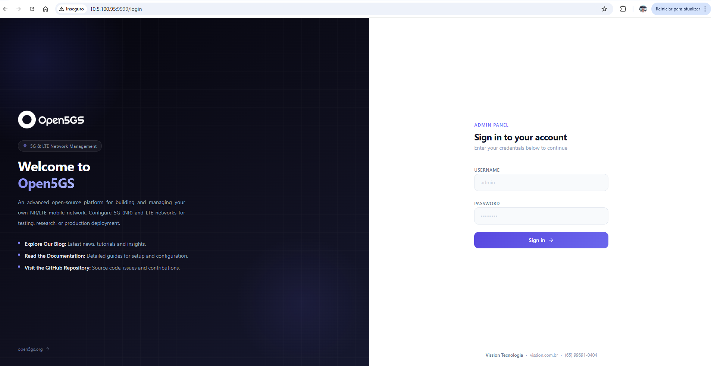
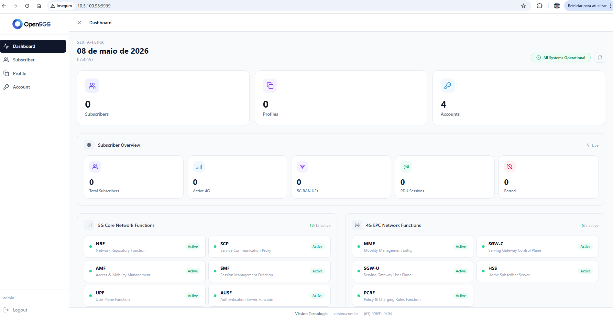
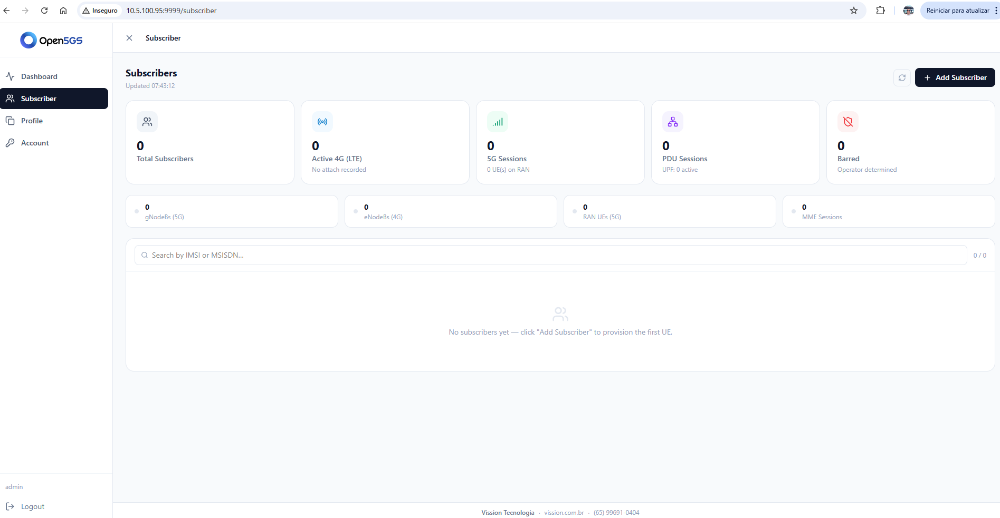
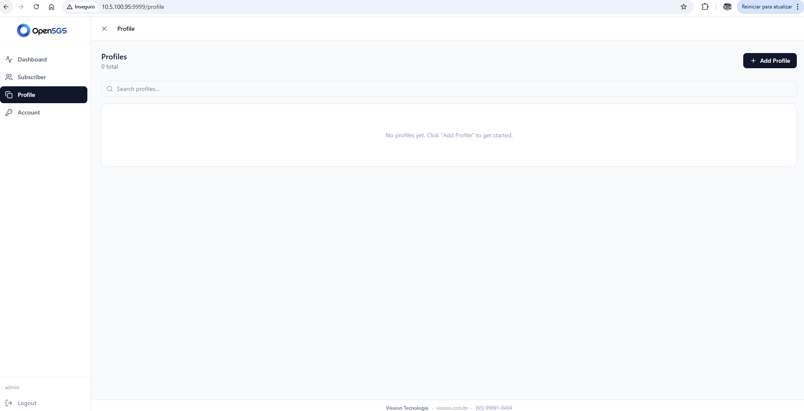

# Open5GS — Instalação Customizada

Instalação automatizada e pronta para uso do [Open5GS](https://open5gs.org/) em Ubuntu 24.04 LTS,
baseada em uma configuração validada em ambiente real.

Este repositório tem como objetivo disponibilizar publicamente uma customização completa
do Open5GS para que **qualquer pessoa** possa replicar uma instalação funcional de 5G Core
e EPC em seu próprio servidor ou VPS, sem precisar partir do zero.

A instalação pode ser feita de duas formas: **manualmente via script** ou usando o
**[Claude Code](https://claude.ai/code)** para guiar todo o processo de forma automatizada.

---

## O que é o Open5GS?

**Open5GS** é uma implementação open-source em C do **5G Core (5GC)** e do **EPC**
(Evolved Packet Core), cobrindo o núcleo de redes NR/LTE conforme a especificação
**3GPP Release-17**.

Ideal para laboratórios, pesquisa, desenvolvimento de aplicações 5G e redes privadas.

- Site oficial: https://open5gs.org  
- Documentação: https://open5gs.org/open5gs/docs/  
- Repositório upstream: https://github.com/open5gs/open5gs

---

## O que este repositório oferece

- Script de instalação completo e funcional para Ubuntu 24.04 LTS
- Arquivos de configuração de todos os componentes 5GC e EPC, com IP detectado automaticamente
- Configuração de rede pré-definida (PLMN, TAC, NAT, IP forwarding)
- Instalação do WebUI para gerenciamento de assinantes
- Pronto para conectar gNB/eNB e UEs

---

## Pré-requisitos

- Ubuntu 24.04 LTS (instalação limpa — servidor físico, VM ou VPS)
- Acesso root ou sudo
- Conexão com a internet (para download dos pacotes)

---

## Opção 1 — Instalação manual via script

```bash
git clone https://github.com/leomarsa/open5gs-setup.git
cd open5gs-setup
sudo bash scripts/install.sh
```

O script detecta o IP do servidor automaticamente. Para especificar manualmente:

```bash
sudo bash scripts/install.sh 192.168.1.10
```

A instalação leva entre 5 e 15 minutos. Ao final, a mensagem `=== Installation complete ===`
confirma o sucesso.

---

## Opção 2 — Instalação via Claude Code (recomendado)

O repositório inclui um arquivo `CLAUDE.md` com instruções completas para o
[Claude Code](https://claude.ai/code) executar toda a instalação de forma guiada.

**Passos:**

1. Instale o Claude Code no servidor:
   ```bash
   npm install -g @anthropic-ai/claude-code
   ```

2. Clone o repositório e entre na pasta:
   ```bash
   git clone https://github.com/leomarsa/open5gs-setup.git
   cd open5gs-setup
   claude
   ```

3. Dentro do Claude Code, peça a instalação:
   ```
   instala o Open5GS neste servidor
   ```

O Claude Code vai ler o `CLAUDE.md`, detectar o IP, executar o script e verificar
todos os serviços automaticamente.

---

## Stack

| Componente | Versão |
|---|---|
| OS | Ubuntu 24.04 LTS (Noble) |
| Open5GS | 2.7.7~noble |
| MongoDB | 8.0 |
| Node.js / WebUI | 20.x |

---

## Componentes instalados

### 5G Core (5GC)

| Sigla | Nome | Função |
|---|---|---|
| NRF | NF Repository Function | Registro e descoberta de funções de rede |
| SCP | Service Communication Proxy | Proxy de comunicação entre NFs |
| AMF | Access and Mobility Management Function | Gerenciamento de acesso e mobilidade dos UEs |
| SMF | Session Management Function | Gerenciamento de sessões PDU |
| UPF | User Plane Function | Roteamento de dados do plano de usuário |
| AUSF | Authentication Server Function | Autenticação de UEs |
| UDM | Unified Data Management | Gestão unificada de dados de assinantes |
| UDR | Unified Data Repository | Repositório de dados de assinantes |
| PCF | Policy Control Function | Controle de políticas de rede |
| BSF | Binding Support Function | Suporte a vinculação de sessões |
| NSSF | Network Slice Selection Function | Seleção de network slice |
| SEPP | Security Edge Protection Proxy | Proteção de borda entre PLMNs |

### EPC (LTE Core)

| Sigla | Nome | Função |
|---|---|---|
| MME | Mobility Management Entity | Gerenciamento de mobilidade LTE |
| SGW-C | Serving GW — Control Plane | Plano de controle do Serving Gateway |
| SGW-U | Serving GW — User Plane | Plano de usuário do Serving Gateway |
| HSS | Home Subscriber Server | Servidor de assinantes LTE |
| PCRF | Policy and Charging Rules Function | Políticas e regras de cobrança LTE |

---

## Configuração de rede padrão

Esta é a configuração aplicada pelo script. Pode ser alterada nos arquivos da pasta `configs/`
antes de executar a instalação.

| Parâmetro | Valor | Como alterar |
|---|---|---|
| MCC | 999 | `configs/amf.yaml` e `configs/mme.yaml` |
| MNC | 70 | `configs/amf.yaml` e `configs/mme.yaml` |
| TAC | 1 | `configs/amf.yaml` e `configs/mme.yaml` |
| SST | 1 (eMBB) | `configs/amf.yaml` |
| UE subnet (IPv4) | 10.45.0.0/16 | `configs/upf.yaml` e `configs/smf.yaml` |
| UE subnet (IPv6) | 2001:db8:cafe::/48 | `configs/upf.yaml` e `configs/smf.yaml` |
| IP forwarding | Habilitado | `configs/99-open5gs.conf` |
| NAT | MASQUERADE para UEs | `scripts/install.sh` |

> **Nota:** O PLMN 999/70 é reservado para testes. Para produção, use o PLMN
> alocado pela sua operadora ou autoridade regulatória.

---

## WebUI

Após a instalação, acesse pelo navegador:

```
http://<IP_DO_SERVIDOR>:9999
Usuário: admin
Senha:   1423
```

> **Importante:** altere a senha padrão após a primeira instalação em ambiente de produção.

### Telas do WebUI

**Login**


**Dashboard**


**Subscribers**


**Profiles**


---

## Verificar serviços

```bash
systemctl is-active \
  mongod open5gs-nrfd open5gs-scpd open5gs-amfd open5gs-smfd open5gs-upfd \
  open5gs-ausfd open5gs-udmd open5gs-udrd open5gs-pcfd open5gs-bsfd \
  open5gs-nssfd open5gs-seppd open5gs-mmed open5gs-sgwcd open5gs-sgwud \
  open5gs-hssd open5gs-pcrfd open5gs-webui
```

Todos devem retornar `active`.

---

## Estrutura do repositório

```
open5gs-setup/
├── scripts/
│   └── install.sh              # Script principal de instalação
├── configs/
│   ├── amf.yaml                # AMF — bind NGAP no IP do servidor
│   ├── smf.yaml                # SMF — sessões PDU
│   ├── upf.yaml                # UPF — bind GTP-U no IP do servidor
│   ├── nrf.yaml / scp.yaml
│   ├── ausf.yaml / udm.yaml / udr.yaml
│   ├── pcf.yaml / bsf.yaml / nssf.yaml
│   ├── sepp1.yaml / sepp2.yaml
│   ├── mme.yaml / sgwc.yaml / sgwu.yaml
│   ├── hss.yaml / pcrf.yaml
│   ├── 99-open5gs.conf         # sysctl: net.ipv4.ip_forward
│   └── freeDiameter/           # Configs Diameter (EPC)
│       ├── mme.conf
│       ├── hss.conf
│       ├── smf.conf
│       └── pcrf.conf
├── CLAUDE.md                   # Instruções para o Claude Code executar a instalação
└── SYSTEM.md                   # Referência técnica da instalação validada
```

---

## Customização

Edite os arquivos em `configs/` antes de rodar o script para personalizar a instalação.
Para alterar após a instalação:

```bash
sudo nano /etc/open5gs/amf.yaml
sudo systemctl restart open5gs-amfd
```

---

## Diagnóstico

```bash
# Logs de um serviço
journalctl -u open5gs-amfd -n 50 --no-pager

# Status do MongoDB
systemctl status mongod

# Status do WebUI
systemctl status open5gs-webui
```

---

## Licença

MIT — livre para uso, modificação e distribuição.
